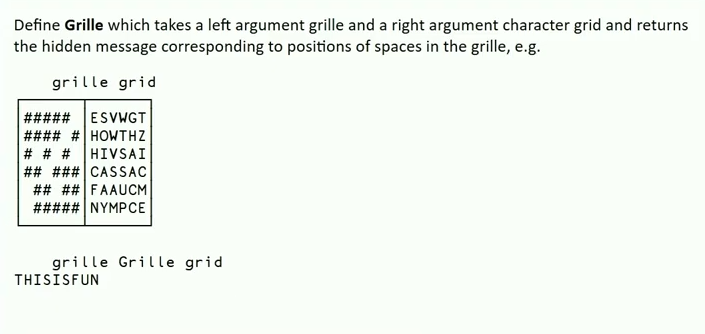

# Grille

---

The optimized version can process 192mb worth of input (both grille and grid)
in ~0.034 seconds. The naive version takes ~0.51 seconds, my java version took
about ~1.70 seconds, and the fastest version I've seen (besides this one) took
~0.31 seconds using C (single threaded).

*As observed on my pc, see the makefile for build flags and measurement method
